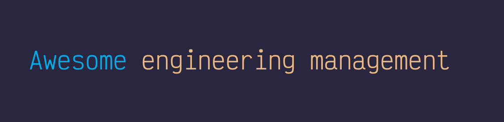

- [Practicing](#practicing)
  - [Models and Methodologies](#models-and-methodologies)
    - [Agile](#agile)
    - [Rapid application development](#rapid-application-development)
    - [Extreme programming](#extreme-programming)
    - [Waterfall](#waterfall)
    - [Rapid Prototyping](#rapid-prototyping)
    - [Incremental](#incremental)
    - [Cleanroom](#cleanroom)
  - [Processes and Artifacts](#processes-and-artifacts)
    - [Project Charter](#project-charter)
    - [Project Management Plan](#project-management-plan)
    - [Work breakdown structure](#work-breakdown-structure)
    - [Capacity Planning](#capacity-planning)
    - [Risk Management](#risk-management)
    - [Stakeholder Management](#stakeholder-management)
    - [Decision Making](#decision-making)
    - [KPI: Key Performance Indicators](#kpi-key-performance-indicators)
    - [Retrospectives](#retrospectives)
    - [SMART Goals](#smart-goals)
    - [Critical Path Method](#critical-path-method)
    - [Launch Plan](#launch-plan)
    - [ADR: Architecture Decision Record](#adr-architecture-decision-record)
    - [Software Architecture Review](#software-architecture-review)
    - [RACI Matrix](#raci-matrix)
    - [Decision tree](#decision-tree)
    - [Gantt Charts](#gantt-charts)
    - [Cause-effect analysis: Fishbone diagrams](#cause-effect-analysis-fishbone-diagrams)
    - [SCRUM Poker planning](#scrum-poker-planning)
    - [Other Documents](#other-documents)
  - [Tools](#tools)
    - [Project and task Management](#project-and-task-management)
    - [Boards](#boards)
    - [Standups](#standups)
    - [Documentation / Knowledge Management](#documentation--knowledge-management)
    - [Communication](#communication)
    - [Email](#email)
    - [Email Clients](#email-clients)
    - [Diagramming & Designing](#diagramming--designing)
    - [Metrics](#metrics)
    - [Calendars](#calendars)
    - [Time Management](#time-management)
    - [Code Hosting](#code-hosting)
    - [Time tracking and contractor management](#time-tracking-and-contractor-management)
    - [Mentoring](#mentoring)
- [Learning](#learning)
  - [Books](#books)
  - [Certifications](#certifications)
  - [Courses](#courses)
  - [Useful resources](#useful-resources)
  - [Other Awesome Lists](#other-awesome-lists)
- [Laws to live by](#laws-to-live-by)

# Practicing

## Models and Methodologies

### Agile
- [Manifesto](http://agilemanifesto.org/)
- [Patterns](https://sites.google.com/site/agilepatterns/)
- [Glossary](https://www.agilealliance.org/agile101/agile-glossary/)
- [Wikipedia](https://en.wikipedia.org/wiki/Agile_software_development)
- [History and background](https://martinfowler.com/articles/newMethodology.html)
- [Steering body](https://www.agilealliance.org/)
- Books
  - [Agile Practice Guide](https://www.amazon.com/Agile-Practice-Project-Management-Institute/dp/1628251999)
  - [PMBOK: A Guide to the Project Management Body of Knowledge ](https://www.amazon.com/Project-Management-Knowledge-PMBOK%C2%AE-Sixth/dp/1628251840)
  - [Essential Scrum: A Practical Guide to the Most Popular Agile Process](https://www.amazon.com/Essential-Scrum-Practical-Addison-Wesley-Signature/dp/0137043295)
  - [Agile Product Management with Scrum](https://www.amazon.com/Agile-Product-Management-Scrum-Addison-Wesley/dp/0321605780)
  - [Learning Agile: Understanding Scrum, XP, Lean, and Kanban](https://www.amazon.com/Learning-Agile-Understanding-Scrum-Kanban/dp/1449331920)
  - [Scrum: The Art of Doing Twice the Work in Half the Time](https://www.amazon.com/Scrum-Doing-Twice-Work-Half/dp/1847941109/133-3474474-6617213?psc=1)
  - [Agile Retrospectives: Making Good Teams Great](https://www.amazon.com/Agile-Retrospectives-Making-Teams-Great/dp/0977616649/133-3474474-6617213?psc=1)

### Rapid application development
- [Introduction](https://ncube.com/blog/what-is-rapid-application-development)
- [Tools](https://marutitech.com/rapid-application-development-tools/)
- Books
  - [Rapid Development: Taming Wild Software Schedules](https://www.amazon.com/Rapid-Development-Taming-Software-Schedules/dp/1556159005/ref=sr_1_1?dchild=1&keywords=rapid+application+development&qid=1623329004&sr=8-1)
- Papers
  - [Rapid application development (RAD): an empirical review](https://www.tandfonline.com/doi/abs/10.1057/palgrave.ejis.3000325)
  - [The utility of rapid application development in large‐scale, complex projects](https://www.academia.edu/download/46943510/j.1365-2575.2009.00329.x20160701-21245-1lkp7e3.pdf)
  - [Rapid Application Development: rough and dirty or value-for-money engineering?](https://dl.acm.org/doi/fullHtml/10.1145/570907.570925)
  - [Risks of rapid application development](https://www.academia.edu/download/43403319/RAD_risks.pdf)
  - [A quality software process for rapid application development](http://doras.dcu.ie/18419/1/Gerard_Coleman.pdf)
- [Wikipedia](https://en.wikipedia.org/wiki/Rapid_application_development)

### Extreme programming
- [Manifesto](http://www.extremeprogramming.org)
- [Process Model](http://www.extremeprogramming.org/rules.html)
- Books
  - [Extreme Programming Explained](https://www.amazon.com/Extreme-Programming-Explained-Embrace-Change/dp/0321278658)
  - [Extreme Programming Applied](https://www.amazon.com/Extreme-Programming-Applied-Playing-Win/dp/0201616408/ref=sr_1_1?dchild=1&keywords=Extreme+Programming+Applied&qid=1623328243&sr=8-1)
  - [Planning Extreme Programming](https://www.amazon.com/Planning-Extreme-Programming-Kent-Beck/dp/0201710919/ref=sr_1_1?dchild=1&keywords=Planning+Extreme+Programming&qid=1623328281&sr=8-1)
- [Wikipedia](https://en.wikipedia.org/wiki/Extreme_programming)

### Waterfall
- [Process Model](https://www.sciencedirect.com/topics/computer-science/waterfall-model)
- [Methodology](https://www.workfront.com/project-management/methodologies/waterfall)
- [References](https://www.ionos.com/digitalguide/websites/web-development/waterfall-methodology/)
- Papers
  - [Production of Large Computer Programs](https://scholar.google.com/scholar?cluster=1388407824739651346&hl=fi&as_sdt=0,5)
  - [Managing the Development of Large Software Systems](http://www-scf.usc.edu/~csci201/lectures/Lecture11/royce1970.pdf)
  - [Iterative and Incremental Development: A Brief History](https://www.computer.org/csdl/magazine/co/2003/06/r6047/13rRUxBJhpL)
- [Wikipedia](https://en.wikipedia.org/wiki/Waterfall_model)

### Rapid Prototyping
- [Introduction](https://www.productplan.com/glossary/rapid-prototyping/)
- [Tools](https://blog.logrocket.com/the-7-best-tools-for-rapid-prototyping/)
- Papers
  - [Rapid prototyping: An alternative instructional design strategy](http://edtc6321learningdesign.pbworks.com/w/file/fetch/77292563/rapidprototypinganalternativeinstructionaldesign.pdf)
  - [Rapid Prototyping in Software Development](https://scholar.google.com/scholar?cluster=8761499927215037412&hl=fi&as_sdt=0,5)
- [Wikipedia](https://en.wikipedia.org/wiki/Software_prototyping)

### Incremental
- Books
  - [Software Engineering: A Practitioner's Approach](https://www.amazon.com/ISE-SOFTWARE-ENGINEERING-PRACTITIONERS-APPROACH/dp/1260548007)
- [Wikipedia](https://en.wikipedia.org/wiki/Incremental_build_model)

### Cleanroom
- [Process Model](https://ieeexplore.ieee.org/abstract/document/268956)
- [Reference](https://resources.sei.cmu.edu/library/asset-view.cfm?assetID=12635)
- Papers
  - [Cleanroom Software Engineering](https://scholar.google.com/scholar?cluster=1315746658937502269&hl=fi&as_sdt=0,5)
  - [Introducing Formal Methods into Industry using Cleanroom and CSP](https://www.semanticscholar.org/paper/Introducing-Formal-Methods-into-Industry-using-and-Broadfoot/be46d7ebad16e6eee1306e61379d2f0a7454e46f)
- Books
  - [Toward Zero-Defect Programming](https://www.amazon.com/Toward-Defect-Programming-Allan-Stavely/dp/0201385953)
- [Wikipedia](https://en.wikipedia.org/wiki/Cleanroom_software_engineering)

## Processes and Artifacts

### Project Charter

- [PMI](https://www.pmi.org/learning/library/charter-selling-project-7473)
- [Wikipedia](https://en.wikipedia.org/wiki/Project_charter)
- [Templates](https://clickup.com/blog/project-charter-template/)

### Project Management Plan

- [Wikipedia](https://en.wikipedia.org/wiki/Project_plan)
- Templates
  - [CDC](https://www2.cdc.gov/cdcup/library/templates/cdc_up_project_management_plan_template.doc)
  - [Atlassian](https://www.atlassian.com/software/confluence/templates/project-plan)
  - [PMI](https://www.projectmanagement.com/contentPages/projectPlan.cfm?ID=121789&thisPageURL=/project-plans/121789/Software-Development-Project-Plan#_=_)

### Work breakdown structure

- [PMI](https://www.pmi.org/learning/library/applying-work-breakdown-structure-project-lifecycle-6979)
- [Wikipedia](https://en.wikipedia.org/wiki/Work_breakdown_structure)
- Templates
  - [CDC](https://www2a.cdc.gov/cdcup/library/templates/CDC_UP_WBS_Template_Style-1.doc)
  - [Atlassian](https://aneto.atlassian.net/wiki/spaces/WBS/overview)
  - [Miro](https://miro.com/templates/work-breakdown-structure/)
  - [Google sheets](https://workspace.google.com/marketplace/app/projectsheet_planning/1080532206233)

### Capacity Planning

- [Wikipedia](https://en.wikipedia.org/wiki/Capacity_planning)
- Templates
  - [CDC](https://www2.cdc.gov/cdcup/library/templates/cdc_up_capacity_planning_template.doc)
  - [Atlassian](https://www.atlassian.com/software/confluence/templates/capacity-planning)
  - [PMI](https://www.projectmanagement.com/deliverables/319867/Capacity-Planning-Template)

### Risk Management

- [Wikipedia](https://en.wikipedia.org/wiki/Risk_management)
- Templates
  - [CDC](https://www2a.cdc.gov/cdcup/library/templates/CDC_UP_Risk_Management_Plan_Template.doc)
  - [Atlassian](https://www.atlassian.com/software/confluence/templates/risk-assessment)

### Stakeholder Management

- [PMI](https://www.pmi.org/learning/library/stakeholder-management-task-project-success-7736)
- [Wikipedia](https://en.wikipedia.org/wiki/Stakeholder_management)

### Decision Making

- Templates
  - [Atlassian](https://www.atlassian.com/software/confluence/templates/decision)
  - [Miro](https://miro.com/templates/decision-making/)

### KPI: Key Performance Indicators

- [Wikipedia](https://en.wikipedia.org/wiki/Performance_indicator)
- [PMI](https://www.pmi.org/learning/library/project-metrics-key-performance-indicators-2903)
- [Clickup](https://clickup.com/blog/agile/agile-metrics/)

### Retrospectives

- Templates
  - [Atlassian](https://www.atlassian.com/software/confluence/templates/retrospective)
  - [Miro](https://miro.com/blog/7-retrospective-templates-love-use-miro/)

### SMART Goals

- [Wikipedia](https://en.wikipedia.org/wiki/SMART_criteria)
- [Atlassian](https://www.atlassian.com/blog/productivity/how-to-write-smart-goals)
- Templates
  - [Atlassian](https://www.atlassian.com/software/confluence/templates/goals-signals-measures)
  - [Miro](https://miro.com/templates/smart-goals/)

### Critical Path Method

- [Wikipedia](https://en.wikipedia.org/wiki/Critical_path_method)
- [PMI](https://www.pmi.org/learning/library/critical-path-scheduling-work-breakdown-6212)
- Templates
  - [Smartsheet](https://www.smartsheet.com/content/critical-path-templates)
  - [Others](https://templatelab.com/critical-path/)

### Launch Plan

- Templates
  - [Atlassian](https://www.atlassian.com/software/confluence/templates/product-launch)
  - [Asana](https://asana.com/templates/for/marketing/product-marketing-launch)

### ADR: Architecture Decision Record

- [Process](https://github.com/joelparkerhenderson/architecture-decision-record)
- Templates
  - [Atlassian](https://www.atlassian.com/software/confluence/templates/decision)

### Software Architecture Review

- Process
  - [Process](https://mozilla.github.io/firefox-browser-architecture/text/0006-architecture-review-process.html)
- Templates
  - [Atlassian](https://www.atlassian.com/software/confluence/templates/software-architecture-review)

### RACI Matrix

- [Wikipedia](https://en.wikipedia.org/wiki/Responsibility_assignment_matrix)
- Templates
  - [Miro](https://miro.com/templates/raci-matrix/) 
  - [Confluence](https://www.atlassian.com/software/confluence/templates/decision)

### Decision tree

- [Wikipedia](https://en.wikipedia.org/wiki/Decision_tree)
- Templates
  - [Miro](https://miro.com/templates/decision-tree/)
  - [Canva](https://www.canva.com/graphs/decision-trees/)

### Gantt Charts

- Templates
  - [Google sheets](https://docs.google.com/spreadsheets/d/1B3BrdD2ypRT0jk1wHyWU9xciVCyExGBruWw-txazE9s/edit#gid=2140549662)

### Cause-effect analysis: Fishbone diagrams

- [Wikipedia](https://en.wikipedia.org/wiki/Ishikawa_diagram)
- [Tutorial](https://www.mindtools.com/pages/article/newTMC_03.htm)
- Templates
  - [Miro](https://miro.com/templates/fishbone-diagram/)
  - [Canva](https://www.canva.com/graphs/fishbone-diagrams/)

### SCRUM Poker planning

- [Wikipedia](https://en.wikipedia.org/wiki/Planning_poker)
- Tools
  - [scrumpoker.online](https://scrumpoker.online/)
  - [Slack bot](https://github.com/nateyolles/slack-pokerbot)
  - [Storyplan for slack](https://www.storyplan.io/)
  - [Android app](https://play.google.com/store/apps/details?id=com.vvkra.planningpoker&hl=en_US&gl=US)

### Other Documents

- Activity attributes
- Activity list
- Assumption log
- Basis of estimates
- Change log
- Cost estimates
- Cost forecasts
- Duration estimates
- Issue log
- Lessons learned register
- Milestone list
- Physical resource assignments
- Project calendars
- Project communications
- Project schedule
- Project schedule network diagram
- Quality control measurements
- Quality metrics
- Quality report
- Requirements documentation
- Requirements traceability matrix
- Resource breakdown structure
- Resource calendars
- Resource requirements
- Risk register
- Risk report
- Schedule data
- Schedule forecasts
- Stakeholder register
- Team charter
- Test and evaluation documents
- Project scope statement
- Project team assignments

## Tools

### Project and task Management

| Link | Description |
| --- | --- |
| [OpenProject](https://github.com/opf/openproject) | OpenProject is the leading open source project management software. |
| [taiga.io](https://github.com/taigaio) | Your Agile, Free and Open Source Project Management Tool |
| [Redmine](https://www.redmine.org/) | Redmine is a flexible project management web application. |
| [Phabricator](https://phacility.com) | Phabricator is a set of tools for developing software. It includes applications for code review, repository hosting, bug tracking, project management, and more. |
| [Jira](https://www.atlassian.com/software/jira) | The #1 software development tool used by agile teams |
| [Asana](https://asana.com) | Work on big ideas, without the busywork. |
| [Trello](https://trello.com) | Trello helps teams move work forward. |
| [Basecamp](https://basecamp.com) | The All-In-One Toolkit for Working Remotely. |
| [Monday](https://monday.com) | Easily build, run, and scale your dream workflows on one platform. |
| [Clickup](https://clickup.com) | All your work in one place: Tasks, docs, chat, goals, & more. |
| [Youtrack](https://www.jetbrains.com/youtrack/) | The project management tool designed for agile teams |
| [Github](https://github.com) | GitHub is where over 65 million developers shape the future of software, together​. |
| [Gitlab](https://gitlab.com) | GitLab is the open DevOps platform |
| [Google sheets](https://sheets.new) | Google Sheets makes your data pop with colorful charts and graphs. |
| [Clubhouse](https://clubhouse.io/) | Project management has never been easier |
| [Microsoft Project](https://www.microsoft.com/en-us/microsoft-365/project/project-management-software) | Meet the simple, powerful, reimagined Project for everyone. |
| [Project Manager](https://www.projectmanager.com/) | Project Management Software for Professionals |

### Boards

| Link | Description |
| --- | --- |
| [focalboard](https://github.com/mattermost/focalboard) | Focalboard is an open source, self-hosted alternative to Trello, Notion, and Asana. |
| [react-kanban](https://github.com/markusenglund/react-kanban) | A server-rendered React app inspired by Trello. |
| [wekan](https://github.com/wekan/wekan) | Open Source kanban |
| [kanboard](https://github.com/kanboard/kanboard) | Kanban project management software |
| [huboard](https://github.com/huboard/huboard) | Instant task management for your GitHub repositories |
| [nullboard](https://github.com/apankrat/nullboard) | Nullboard is a minimalist kanban board, focused on compactness and readability. |

### Standups

| Link | Description |
| --- | --- |
| [git-standup](https://github.com/kamranahmedse/git-standup) | Recall what you did on the last working day. |
| [standuptimer.app](https://standuptimer.app) | Use this free timer for your team standups to keep them on track |
| [scrumbot](https://github.com/redsift/scrumbot) | Slack bot for standup meetings |
| [slack-standup-bot](https://github.com/colestrode/slack-standup-bot) | Daily, weekly, whenever standup bot for Slack |
| [standup-raven](https://github.com/standup-raven/standup-raven) | A Mattermost plugin for communicating daily standups across teams |

### Documentation / Knowledge Management

| Link | Description |
| --- | --- |
| [Confluence](https://www.atlassian.com/software/confluence) | Confluence is your remote-friendly team workspace where knowledge and collaboration meet. |
| [Notion](https://notion.so) | One tool for your whole team. Write, plan, and get organized. |
| [Bookstack](https://github.com/BookStackApp/BookStack) | A platform to create documentation/wiki content built with PHP & Laravel |
| [Mediawiki](https://github.com/wikimedia/mediawiki) | The collaborative editing software that runs Wikipedia. |
| [Dropbox paper](https://www.dropbox.com/paper) | Real-time editing for teams. |
| [Google docs](https://docs.new) | Google docs |
| [Instiki](https://github.com/parasew/instiki) |  Basic wiki clone so pretty and easy to set up, you’ll wonder if it’s really a wiki.  |
| [Nuclino](https://www.nuclino.com) | A lightweight and collaborative wiki for all your team's knowledge, docs, and notes. |
| [Slite](https://slite.com) | The perfect communication tool for remote teams |

### Communication

| Link | Description |
| --- | --- |
| [Slack](https://slack.com/) | Slack makes it downright pleasant to work together |
| [Mattermost](https://mattermost.com/) | The Only Open Source Collaboration Platform for Developers |
| [Discord](https://discord.com/) | A place that makes it easy to talk every day and hang out more often. |
| [Rocket.chat](https://rocket.chat/) | Keep the workflow going by centralizing all your tools and touchpoints in one platform. Made for team collaboration, DevOps and customer engagement. |
| [jitsi](https://jitsi.org/) | More secure, more flexible, and completely free video conferencing |
| [Google Meet](https://meet.google.com/) | Real-time meetings by Google. |
| [Microsoft Teams](https://teams.microsoft.com/) | Microsoft Teams is the hub for team collaboration in Microsoft 365 that integrates the people, content, and tools your team needs. |
| [Gitter](https://gitter.im/) | Gitter is a chat and networking platform that helps to manage, grow and connect communities through messaging, content and discovery. |
| [Flock](https://www.flock.com/) | Your new home for collaboration. |
| [flat.social](https://www.flat.social/) | Spatial online meetings for remote teams that promote collaboration, creativity and spontaneous interactions. |
### Email

| Link | Description |
| --- | --- |
| [Protonmail](https://protonmail.com) | Secure Email Based in Switzerland |
| [Tutanota](https://tutanota.com) | Tutanota is the world's most secure email service, easy to use and private by design. |
| [mailinabox](https://mailinabox.email) | Mail-in-a-Box lets you become your own mail service provider in a few easy steps. |
| [Gmail](https://mail.google.com) | Gmail is email that's intuitive, efficient, and useful. |

### Email Clients

| Link | Description |
| --- | --- |
| [Nylas](https://github.com/nylas/nylas-mail) | An extensible desktop mail app built on the modern web. |
| [Mailspring](https://github.com/Foundry376/Mailspring) | A beautiful, fast and fully open source mail client for Mac, Windows and Linux. |
| [Thunderbird](https://www.thunderbird.net/) | Make Email Easier. |
| [Shift](https://tryshift.com/) | Shift is a desktop app for streamlining all of your email and app accounts. |
| [Rambox](https://github.com/ramboxapp/community-edition) | Free and Open Source messaging and emailing app that combines common web applications into one. |
| [K9](https://github.com/k9mail/k-9) | K-9 Mail – Open Source Email App for Android |
| [Evolution](https://help.gnome.org/users/evolution/stable/) | Evolution is a fully-featured open source groupware application |
| [Microsoft Office Outlook](https://office.microsoft.com/outlook) | Outlook is a personal information manager that lets you manage your e-mail, calendar, contacts, and tasks. |

### Diagramming & Designing

| Link | Description |
| --- | --- |
| [Draw.io](https://draw.io) | Flowchart Maker and Online Diagram Software |
| [Lucidchart](https://www.lucidchart.com/) | Lucidchart is the intelligent diagramming application that brings teams together to make better decisions and build the future. |
| [Miro](https://miro.com) | The online collaborative whiteboard platform to bring teams together, anytime, anywhere. |
| [Sketch](https://www.sketch.com/) | A home for the entire collaborative design process.‎ |
| [Invision](https://www.invisionapp.com/) | The digital product design platform powering the world’s best user experiences |
| [Figma](https://www.figma.com/) | Figma brings your teams together to design better products from start to finish. |
| [Zeplin](https://zeplin.io/) | Deliver on the promise of design |

### Metrics

| Link | Description |
| --- | --- |
| [jira-agile-metrics](https://github.com/DeloitteDigitalUK/jira-agile-metrics) | A tool to extract Agile metrics and charts from JIRA projects and Trello Boards |
| [agile-metrics-tools](https://github.com/patitalabs/agile-metrics-tools) | Agile metrics tools allows you to track metrics from different sources |
| [agile-metrics](https://github.com/DaGrisa/agile-metrics) | collecting agile metrics from jira, bitbucket, sonarqube and send them to elastic stack to visualize in kibana |
| [jira-metrics-extract](https://github.com/rnwolf/jira-metrics-extract) | CLI tool to extract metrics from Jira, save data and charts locally for further analysis & presentation |
| [pandas_agile_metrics](https://github.com/rnwolf/pandas_agile_metrics) | Actionable Agile metrics analysis tool kit based on Python |
| [aafmp](https://savannah.nongnu.org/projects/aamfp) | a simple personal kanban metrics spreadsheet |
| [jira-agile-velocity](https://github.com/Fgerthoffert/jira-agile-velocity) | Connect to Jira REST API to collect completed story points, calculate weekly velocity, and estimate completion date |

### Calendars

| Link | Description |
| --- | --- |
| [Tutanota](https://tutanota.com/calendar) | Zero-knowledge calendar |
| [Proton Calendar](https://calendar.protonmail.com) | Encrypted calendar |
| [Calendso](https://calendso.com/) | The Open Source Calendly Alternative |
| [Calendly](https://calendly.com/) | Calendly is your hub for scheduling meetings professionally and efficiently, eliminating the hassle of back-and-forth emails so you can get back to work. |
| [Appoint.ly](https://appoint.ly/) | Appointment scheduling software helps to book 1-on-1 meetings with people all over the world, avoid double booking and save time! |
| [Zeeg](https://zeeg.me/) | Your smart business card! An advanced scheduling assistant with your own beautiful minimal website. Your Zeeg link is the only link you really need! |

### Time Management

| Link | Description |
| --- | --- |
| [activitywatch](https://github.com/ActivityWatch/activitywatch) | Records what you do so that you can know how you've spent your time. |
| [marinara](https://github.com/schmich/marinara) | Marinara is a time management assistant for Chrome that follows the Pomodoro Technique. |
| [pomotroid](https://github.com/Splode/pomotroid) | Simple and visually-pleasing Pomodoro timer |
| [pomatez](https://github.com/roldanjr/pomatez) | Stay Focused. Take a Break. |
| [gnome-pomodoro](https://github.com/gnome-pomodoro/gnome-pomodoro) | A time management utility for GNOME based on the pomodoro technique! |
| [Goodtime](https://github.com/adrcotfas/Goodtime) | productivity app for Android |

### Code Hosting

| Link | Description |
| --- | --- |
| [Github](https://github.com) | GitHub is where over 65 million developers shape the future of software, together​. |
| [Gitlab](https://gitlab.com) | GitLab is the open DevOps platform |
| [Gitea](https://gitea.com) | A painless, self-hosted Git service |
| [Sourcehut](https://sr.ht) | sourcehut, the hacker's forge! |
| [Launchpad](https://code.launchpad.net) | Launchpad can host your project’s source code using the Bazaar version control system. |

### Time tracking and contractor management

| Link | Description |
| --- | --- |
| [Invoiceninja](https://github.com/invoiceninja/invoiceninja) | Invoices, Expenses and Tasks built with Laravel and Flutter |
| [Wakatime](https://github.com/wakatime) | Dashboards for developers, powered by open source IDE plugins. |
| [Activitywatch](https://github.com/ActivityWatch/activitywatch) | Records what you do so that you can know how you've spent your time. |
| [Super-productivity](https://github.com/johannesjo/super-productivity) | To-do list & time tracker for programmers and other digital workers with Jira, Github, and Gitlab integration |
| [Toggldesktop](https://github.com/toggl-open-source/toggldesktop) | Toggl Desktop is a Toggl time tracking client |
| [Kimai2](https://github.com/kevinpapst/kimai2) | Kimai v2 is a web-based multiuser time-tracking application |
| [ShareX](https://github.com/ShareX/ShareX) | ShareX is a free and open source program that lets you capture or record any area of your screen and share it with a single press of a key |

### Mentoring

| Link | Description |
| --- | --- |
| [developer-roadmap](https://github.com/kamranahmedse/developer-roadmap) | Roadmap to becoming a web developer in 2021 |
| [awesome-quality-assurance-roadmap](https://github.com/fityanos/awesome-quality-assurance-roadmap) | The starting point of your career as a Software Quality Assurance Engineer | Quality Automation Engineer |
| [design-patterns-for-humans](https://github.com/kamranahmedse/design-patterns-for-humans) | An ultra-simplified explanation to design patterns |
| [ossu/computer-science](https://github.com/ossu/computer-science) | Path to a free self-taught education in Computer Science! |
| [awesome-falsehood](https://github.com/kdeldycke/awesome-falsehood) | Falsehoods Programmers Believe in |
| [system_design](https://github.com/shashank88/system_design) | Preparation links and resources for system design questions |
| [study-path](https://github.com/joebew42/study-path) |  An organized learning path about Clean Code, Test-Driven Development, Legacy Code, Refactoring, Domain-Driven Design and Microservice Architecture |
| [best-practices-checklist](https://github.com/palash25/best-practices-checklist) | A list of awesome idiomatic code resources. |
| [pointers-for-software-engineers](https://github.com/vicoyeh/pointers-for-software-engineers) | A curated list of topics to start learning software engineering |
| [evergreen-skills-developers](https://github.com/romenrg/evergreen-skills-developers) | List of evergreen skills, based on software development best practices & cross-framework principles, that should serve as a fair assessment of skilled software engineers / developers |
| [awesome-courses](https://github.com/prakhar1989/awesome-courses) | List of awesome university courses for learning Computer Science! |
| [awesome-testing-courses](https://github.com/upgundecha/awesome-testing-courses) | A curated list of awesome online courses and tutorials on software testing, test automation and more. |
| [System design primer](https://github.com/donnemartin/system-design-primer) | Learn how to design large-scale systems. Prep for the system design interview. Includes Anki flashcards. |

# Learning

## Books

- [The Manager's Path](https://www.amazon.com/Managers-Path-Leaders-Navigating-Growth/dp/1491973897)
- [The Making of a Manager](https://www.amazon.com/Making-Manager-What-Everyone-Looks/dp/0735219567)
- [An Elegant Puzzle](https://www.amazon.com/Elegant-Puzzle-Systems-Engineering-Management/dp/1732265186/)
- [High Growth Handbook](https://www.amazon.com/High-Growth-Handbook-Elad-Gil/dp/1732265100/)
- [Accelerate: The Science of Lean Software and DevOps](https://www.amazon.com/Accelerate-Software-Performing-Technology-Organizations/dp/1942788339/)
- [Managing the Unmanageable](https://www.amazon.com/Managing-Unmanageable-2nd-Mickey-Mantle/dp/0135667364/)
- [Mythical Man-Month](https://www.amazon.com/Mythical-Man-Month-Software-Engineering-Anniversary/dp/0201835959/)
- [The DevOps Handbook](https://www.amazon.com/DevOps-Handbook-World-Class-Reliability-Organizations/dp/1942788002/)
- [Team Topologies](https://www.amazon.com/Team-Topologies-Organizing-Business-Technology/dp/1942788819)

## Certifications

- [https://www.pmi.org/certifications](https://www.pmi.org/certifications)
- Others: https://www.cio.com/article/3210765/top-project-management-certifications.html

## Courses

- [Engineering Management Interview Course - Exponent](https://www.tryexponent.com/courses/engineering-management)
- [Foundations of Project Management by Google - Coursera](https://www.coursera.org/learn/project-management-foundations)
- [Ace Manager Job Interview & Career (Engineering Tech & Other - Udemy](https://www.udemy.com/course/acemanager/)
- [Practical Team Management for Software Engineers - PluralSight](https://www.pluralsight.com/courses/practical-team-management-software-engineers)

## Useful resources

| Link | Description |
| --- | --- |
| [Career Ladders](https://career-ladders.dev) | Roles and responsibilities of various members of tech. |
| [Engineering Ladders](http://www.engineeringladders.com) | A framework for Engineering Managers. |
| [levels.fyi](http://levels.fyi/) | Compensations at various levels |

## Related Awesome Lists

| Link | Description |
| --- | --- |
| [the-engineering-managers-booklist](https://github.com/jesselpalmer/the-engineering-managers-booklist) | Books for people who are or aspire to manage/lead team(s) of software engineers |
| [awesome-cto](https://github.com/kuchin/awesome-cto) | A curated and opinionated list of resources for Chief Technology Officers, with the emphasis on startups |
| [awesome-startup](https://github.com/KrishMunot/awesome-startup) | All the required resources to build your own startup |
| [engineering-management](https://github.com/charlax/engineering-management) | A collection of inspiring resources related to engineering management and tech leadership |
| [awesome-leading-and-managing](https://github.com/LappleApple/awesome-leading-and-managing) | Awesome List of resources on leading people and being a manager. Geared toward tech, but potentially useful to anyone. |
| [awesome-engineering-team-management](https://github.com/kdeldycke/awesome-engineering-team-management) | How to transition from software development to engineering management |
| [engineering-blogs](https://github.com/kilimchoi/engineering-blogs) | A curated list of engineering blogs |
| [empathy-in-engineering](https://github.com/KimberlyMunoz/empathy-in-engineering) | A curated list of resources for building and promoting more compassionate engineering cultures |
| [awesome-project-management](https://github.com/shahedbd/awesome-project-management) | Awesome lists about Project Management interesting and useful topics. |
| [engineer-manager](https://github.com/ryanburgess/engineer-manager) | A list of engineering manager resource links. |

# [Laws to live by](https://github.com/dwmkerr/hacker-laws)
